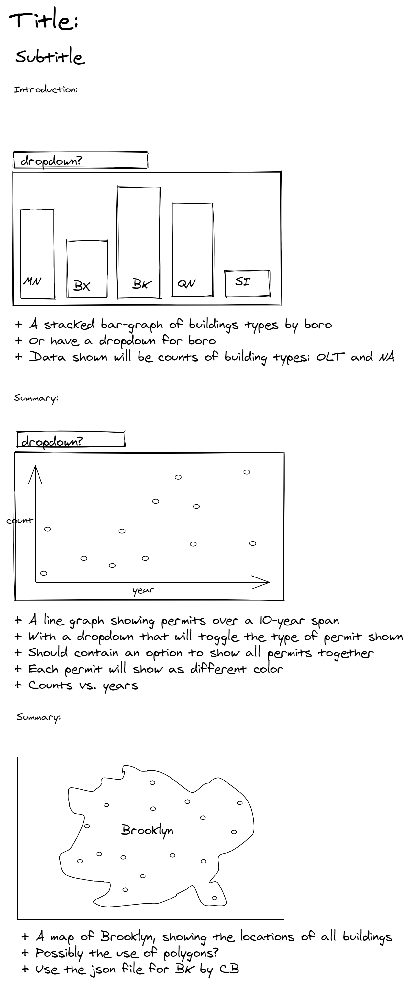
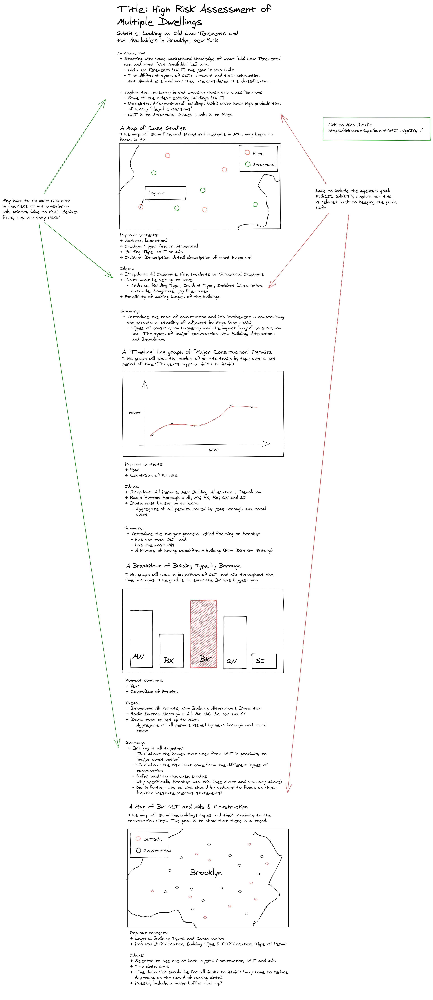
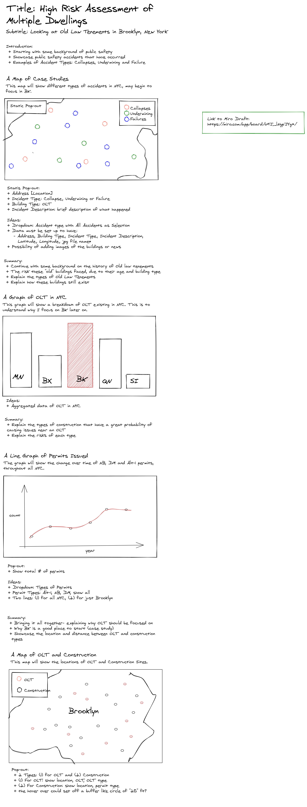
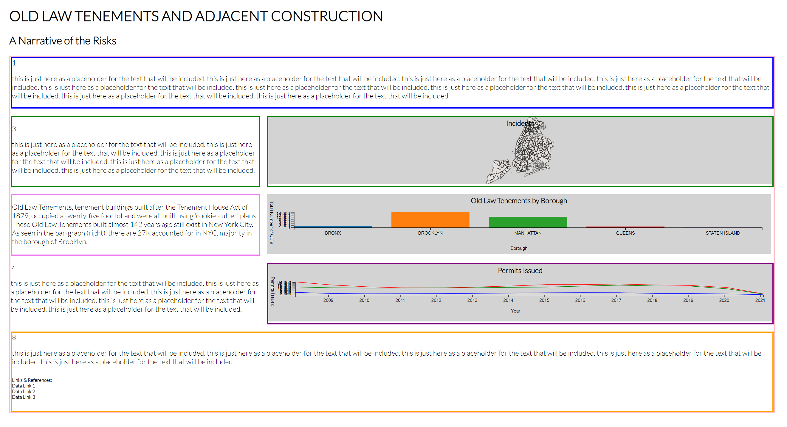

# Project 1: Old Law Tenements & Adjacent Construction

## Abstract

## Artifacts
### Sketches
**Sketch 1:** My initial sketched of what Project 1 was intended to be.

**Sketch 2:** The second sketch created for Project 1.

**Sketch 3:** The third sketch created for Project 1, includes changes made due to feedback received during the ideation workshop.

The order in which the visualizations were originally was changed, so that the map of incidences was first and could be use to present the topic. The linegraph and bargraph order also change to go with the development of the story.

### Iterations
**Iteration 1**

This iteration distinct to the sketches as more thought was given to the structure of the page. The second map was removed after feedback received from the class presentations.

**Iteration 2**

This iteration continues to have the same row and column structure used in iteration 1. However, this iteration includes the use of Mapbox and images. The use of images was due to feedback received during the class presentations and the use of Mapbox after a discussion with the Professor.

### Final

