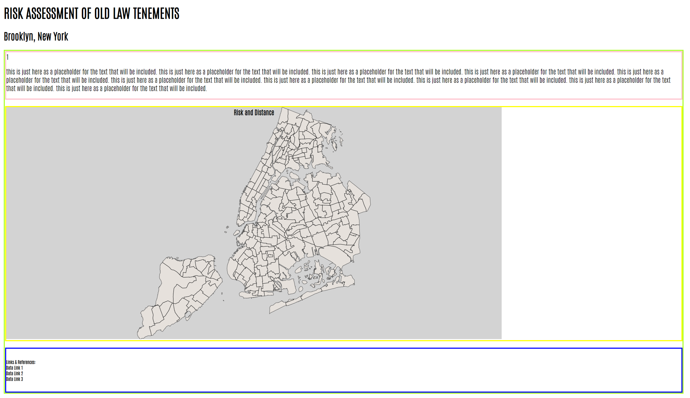
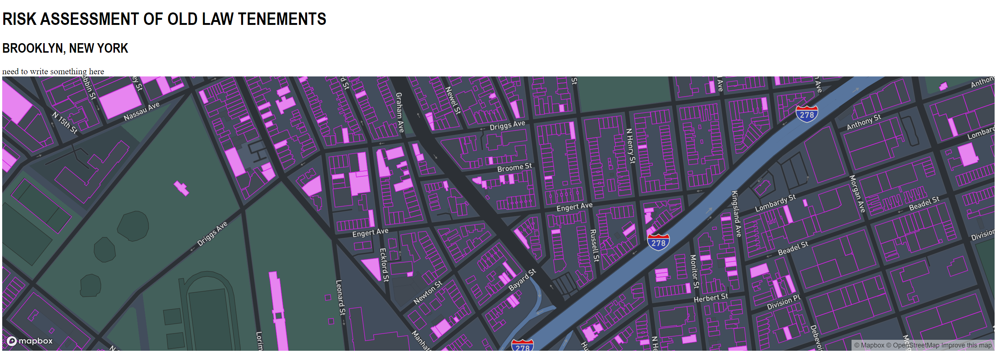

# Project 2: Demo: Community Board 301

## Abstract
The objective of this project is to create a tool, which can be used to understand and locate the different factors contributing to the high risk Old Law Tenements present to the public if not monitored. By mapping Community Board 301's building population, labeling the different factors discussed in Project 1,

* Is the building an Old Law Tenement? (Built between 1829 to 1910)
* Is the building a site for construction?
* Is the building a site adjacent to a construction site?
* Is the building a site with history of complaints related to present risk? (Was a complaint made?)

allows the user to see the interactions between the different factors. The user, or policy maker, given a tool to better understand visually arguments presented in Project 1, provides an alternative way to reach my audience.

## Artifacts
### Sketches
**Sketch 1:** My initial sketch of what Project 2 was intended to be.

Originally, the idea was to create a page where the sole item present was a map. The map was intended to be an svg where geojson files were going to be imported an appended to an svg. The items were meant to be statis, the layers were not going to be toggled and the only item that would make the object interactive would be the ability to hover over a building and see a description card on the side.

**Sketch 2:** The second sketch created for Project 2. 

After discussing with the Professor and working through the ideation workshop, a few items changed. Instead of incorporating a sidebar for the description card, the information would now be set on the map (right-hand corner) triggered by hovering over a building. The map would present a legend showing all the different component included on the map. Instead of creating an svg and importing multiple geojson files, Mapbox GL JS was used to create the viewbox for the map. Per feedback, the use of Mapbox allowed for faster speeds and cleaner use of all the data files.

### Iterations
**Iteration 1**

**Interation 2**

### Final
